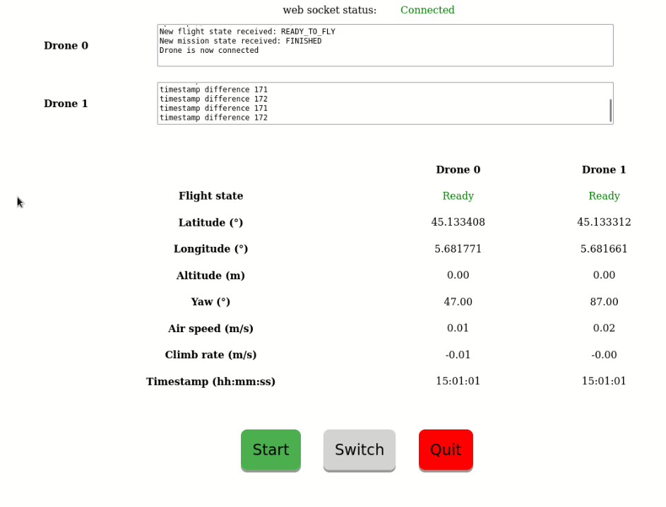

# Javascript drone #

## Presentation ##

* Deploy `user.js` flight script on a drone swarm
* Deploy a GUI on subscribers
* Run the flight script or the GUI as a SlapOS service

## Parameters ##

* autopilotType: Select which autopilot wrapper should be used
* autopilotIp: IPv4 address to identify the autopilot from the companion board
* autopilotPort: Port on whichautopilot serviceis running
* droneList: List of computer on which flight script must be deployed
* debug: Must be set to 'true' to send drone logs through OPC-UA
* multicastIp: IPv6 of the multicast group of the swarm
* operatorScript: URL of operator's script to prepare the flight
* mapJson: URL of terrain's map used by the operator script
* flightScript: URL of user's script to execute to fly drone swarm
* subscriptionScript: URL of the script which will be executed by subscribers
* loopPeriod: Minimal period (in milliseconds) between 2 executions of the flight script loop
* subscriberList: List of computer on which a GUI must be deployed

## How it works ##

For each computer listed in `droneGuidList` and `subscriberGuidList` the `peer` SR type will be instanciated.

Each instance will return a `instance-path`. Under this path one will find `quickjs binary` in `bin` folder
and `scripts` in `etc` folder. Subcribers also return a `httpd-url` (the GUI address) and a `websocket-url` (used by the
GUI).

`quickjs binary location` `scripts location`/main.js `scripts location`/user.js is run as a SlapOS service. This allows
each instance to communicate with the others through OPC-UA pub/sub. For the drones it also establishes a connexion with
the UAV autopilot, for a subscriber it sends the pub/sub messages through the websocket.

## Web GUI (subcribers)

### Drones informations

For each drone is displayed:
* the user script and autopilot logs
* the flight state (ready, flying, landing)
* the latitude in degrees
* the longitude in degrees
* the relative altitude in meters
* the yaw angle in degrees
* the speed (ground speed for multicopters, airspeed for fixed wings) in meters per second
* the climb rate in meters per second
* the timestamp of the position in format hh:mm:ss

### Buttons

* Start: loads operator script and changes into a stop button
* Stop: sends a "stop" message to the swarm
* Switch leader: sends a "switch" message to the swarm, it is usually used to change the leader
* Quit: exits (closes websocket and stops pub/sub)

